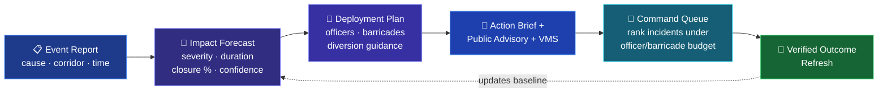
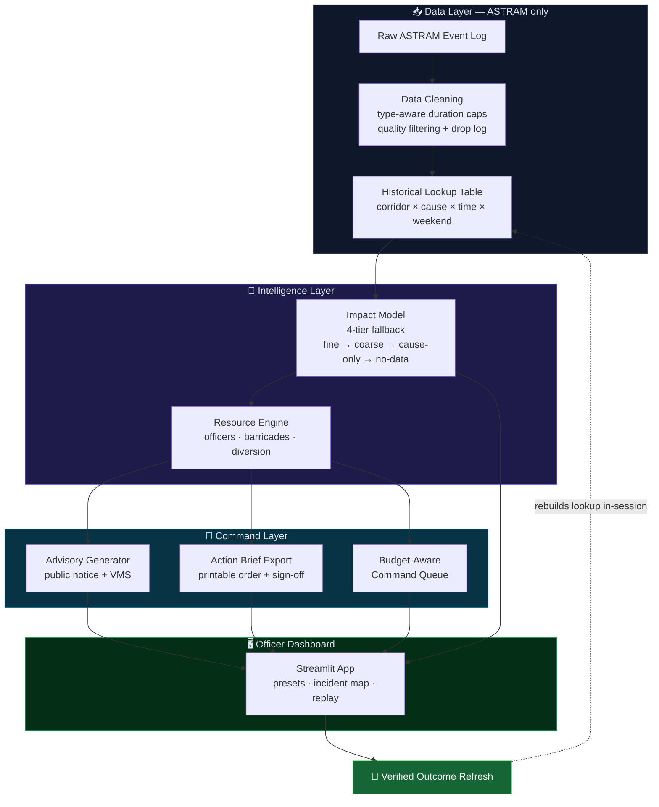

<div align="center">

# 🚦 GeoVision

### From a single event report to a deployment-ready command decision — in seconds.

**An evidence-backed traffic-impact planner for Bengaluru Traffic Police**

*Forecast impact · Recommend deployment · Generate advisories · Allocate resources · Refresh from verified outcomes*

<br>


**Gridlock Hackathon 2.0 · Round 2 · Flipkart × Bengaluru Traffic Police**
**Problem Statement: Event-Driven Congestion (Planned & Unplanned)**

</div>

---

> ### 💬 One line
> **GeoVision turns a traffic-event report into a deployment-ready BTP action brief, ranks simultaneous incidents under limited officer/barricade budgets, and sharpens its own predictions from officer-verified outcomes — using only the provided ASTRAM data, validated honestly.**

---

## 1 · The Problem, In BTP's Own Words

> *"Political rallies, festivals, sports events, construction activities, and sudden gatherings create localized traffic breakdowns. Event impact is not quantified in advance, resource deployment is experience-driven, and there is no post-event learning system."*

Three operational gaps — and a direct response to each:

| 🚧 BTP Challenge | ✅ GeoVision Response |
| :--- | :--- |
| **Impact is not quantified in advance** | Predicts severity, duration, road-closure probability **and a confidence label** from historical ASTRAM patterns |
| **Deployment is experience-driven** | Recommends officers, barricading and diversion guidance, exports a **printable BTP Action Brief**, and ranks simultaneous incidents under a fixed resource budget |
| **No post-event learning system** | **Verified Outcome Refresh** folds officer-verified outcomes back into the historical baseline — live, in-session |

---

## 2 · See It In 60 Seconds



**Demo flow (no typing required):**
1. **Click a scenario** — `Planned Public Event` · `Unplanned Breakdown` · `Rare Event – Limited Evidence`
2. **Read the forecast** — severity tier, expected duration, closure probability, *and how many similar past events back it*
3. **Get the plan** — officer count, barricade placement, diversion decision, with rationale
4. **Export** — public advisory + VMS message + printable **BTP Action Brief** with sign-off fields
5. **Allocate** — run the **Budget-Aware Command Queue** across multiple live incidents
6. **Close the loop** — log a verified outcome and *watch the next prediction change*

---

## 3 · System Architecture



---

## 4 · Core Features

| Feature | What It Does |
| :--- | :--- |
| 🔮 **Impact Forecast** | Estimates duration, severity tier, closure probability and a confidence label |
| 🪜 **4-Tier Fallback** | `fine → coarse → cause-only → no-data` — **never fails silently, never fabricates** |
| 🔍 **Explainability** | Every forecast shows *evidence count*, *match level* and *plain-English rationale* |
| 👮 **Resource Recommendation** | Officer counts, barricade placement, diversion decision support — all config-driven |
| 📢 **Public Advisory Generator** | Editable BTP-style public notice + short VMS sign-board message |
| 📄 **Action Brief Export** | Printable command brief — evidence, deployment, advisory, sign-off fields |
| 🧮 **Budget-Aware Command Queue** | Ranks simultaneous incidents and allocates limited officers/barricades **without exceeding budget** |
| 🔁 **Verified Outcome Refresh** | Officer-verified outcomes rebuild the historical lookup, live in-session |
| ▶️ **Live Incident Replay** | Replays historical ASTRAM events through the full pipeline (accelerated, not a live feed) |
| 🗺️ **Incident Map** | Geospatial evidence using **only** dataset coordinates |

---

## 5 · Why GeoVision Is Different

Most submissions stop at *"an ML prediction dashboard."* GeoVision is built to be **adopted by an officer tomorrow morning.**

<table>
<tr>
<td width="50%" valign="top">

### 🔎 Explainable by design
Every output answers the question an officer must defend to leadership:
> *"Based on how many similar past events, what happened, and how confident are we?"*

A black-box probability of `0.87` can't justify a deployment. *"High severity — 80 past breakdowns on this corridor, median 48 min"* can.

</td>
<td width="50%" valign="top">

### ✅ Honest validation
We **caught and rejected** an earlier inflated **79.62%** result that used a random split and leakage-prone preprocessing. Our reported numbers use a strict **chronological, training-period-only** split.

*We'd rather report a defensible number than an impressive one.*

</td>
</tr>
<tr>
<td width="50%" valign="top">

### 📦 Dataset-compliant
The shipped pipeline uses **only** the provided ASTRAM dataset. No external APIs, no scraped data, no synthetic training data, and **no fabricated diversion routes** the data can't support.

</td>
<td width="50%" valign="top">

### 🎯 Operationally complete
Forecast → deployment plan → advisory → printable brief → multi-incident allocation → post-event learning. The **entire command workflow**, not a single prediction.

</td>
</tr>
</table>

---

## 6 · Validation Results

> **How we validated:** events ordered by time, trained on the **oldest 80%**, tested on the **newest 20%** — simulating real forecasting of unseen future events. Lookup tables, label-reliability decisions and model vocabulary are built from the **training period only**. No leakage.

### 🎯 Primary Benchmark — 3-Class Severity (Low / Medium / High)

| Model | Accuracy | Macro F1 | Notes |
| :--- | :---: | :---: | :--- |
| Majority Baseline | 47.61% | 0.2150 | Always predicts the most common class |
| **🏆 Rule-Based System (ours)** | 52.04% | **0.4906** | **Best balance across all severity classes** |
| RandomForest | **58.23%** | 0.4719 | Higher accuracy, but collapses on the Medium class |

> **Why macro-F1 beats raw accuracy here:** the RandomForest's higher accuracy comes from almost ignoring the **Medium-severity** class (≈6% recall). A model that quietly fails to flag medium events is a worse command tool than one that's marginally less accurate but has **no blind spots.** Operational reliability > leaderboard accuracy.

### 🚧 Supporting Benchmark — Binary Road-Closure Risk

*Chronological 70/15/15 split · threshold tuned on validation only · closure prevalence ~6–9%*

| Method | PR-AUC | Balanced Acc | Recall | F1 | Accuracy |
| :--- | :---: | :---: | :---: | :---: | :---: |
| Majority baseline | 0.077 | 50.0% | 0.0% | 0.000 | 92.3% |
| **Cause-rate baseline** | 0.235 | **70.0%** | **48.2%** | **0.391** | 88.4% |
| RandomForest | **0.240** | 67.6% | 44.7% | 0.347 | 87.0% |

> Closure is rare, so **accuracy alone is misleading** — an always-"no closure" model scores 92% while catching *nothing*. PR-AUC, recall and balanced accuracy are the metrics that reveal whether a method actually finds the operationally critical events.
>
> **The honest finding:** a black-box RandomForest does **not** clearly beat a transparent cause-rate heuristic here (PR-AUC +0.005, F1 −0.043). Most of the predictable structure in road closures is already captured by knowing the *event cause* — which is exactly why we ship the **explainable** system and present this as supporting evidence, not a headline ML win.

📂 Full methodology: [`docs/model_validation_results.md`](docs/model_validation_results.md) · [`docs/binary_closure_benchmark_results.md`](docs/binary_closure_benchmark_results.md)

---

## 7 · Project Structure

```
GEovision_PS2/
├── app/
│   └── dashboard.py              # Streamlit command dashboard (presets · map · replay)
├── src/
│   ├── data_cleaning.py          # Raw ASTRAM → cleaned events
│   ├── feature_engineering.py    # Cleaned events → historical lookup
│   ├── impact_model.py           # 4-tier impact forecast
│   ├── resource_engine.py        # Officers · barricades · diversion
│   ├── advisory_generator.py     # Public advisory + VMS message
│   ├── action_brief.py           # Printable BTP Action Brief export
│   ├── command_queue.py          # Budget-Aware Command Queue
│   ├── feedback_loop.py          # Verified Outcome Refresh
│   ├── model_validation.py       # 3-class severity benchmark
│   └── binary_closure_benchmark.py
├── data/{raw,processed}/         # ASTRAM data (raw never modified)
├── docs/                         # Validation reports + methodology
├── tests/                        # 13 regression tests
└── requirements.txt
```

---

## 8 · How To Run

```bash
# 1. Clone & install
git clone https://github.com/rajstories/GEovision_PS2.git
cd GEovision_PS2
python3 -m pip install -r requirements.txt

# 2. Launch the dashboard
python3 -m streamlit run app/dashboard.py     # opens at http://localhost:8501
```

<details>
<summary><b>Developer commands — tests, validation, data regeneration</b></summary>

```bash
# Run the test suite (13 tests)
python3 -m unittest discover -s tests -v

# Reproduce the benchmarks
python3 src/model_validation.py
python3 src/binary_closure_benchmark.py

# Regenerate processed data from the raw ASTRAM log
python3 src/data_cleaning.py
python3 src/feature_engineering.py
```
</details>

No API keys. No GPU. No cloud. Runs on any officer's laptop.

---

## 9 · Known Limitations (Stated Honestly)

- **Diversion routes** — the system flags *when* a diversion is needed but does **not** invent named alternate routes, because road-network topology is not in the ASTRAM dataset. It points to BTP's Standard Diversion Plan instead.
- **Command Queue** — a **deterministic, rule-based allocator** with visible weights, *not* a mathematical optimizer. Every ranking is traceable to a named weight.
- **Verified Outcome Refresh** — updates the **in-session** lookup; a production rollout would add role-based approval and audit controls.
- **Live feed** — demonstrated via **accelerated historical replay**, not an authenticated live ASTRAM integration.

> These aren't weaknesses we're hiding — they're the boundary between *what the data supports* and *what would require more.* Drawing that line clearly is the difference between a prototype and a pitch.

---

## 10 · Built On BTP's Real Operating Context

- **ASTraM** — BTP's live congestion-monitoring platform. GeoVision *complements* it: ASTraM monitors the present; GeoVision **forecasts impact and recommends resources**.
- **Sanchara Spandana** — BTP's traffic-station beat system, which our `police_station`-level recommendations align to.
- **FHWA — Managing Travel for Planned Special Events** — the international *Impact Analysis → Management Plan → Post-Event Evaluation* cycle our pipeline implements in lightweight form.

---

<div align="center">

### GeoVision

**Forecast the impact. Plan the deployment. Learn from the outcome.**

*Built for practical traffic command — not just leaderboard accuracy.*

**Gridlock Hackathon 2.0 · Flipkart × Bengaluru Traffic Police**

</div>
